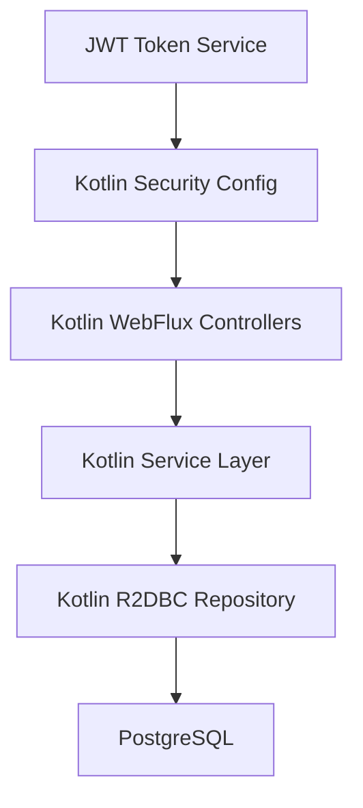

# KOL REST API - Java 24 + Kotlin 전환 아키텍처

## 소개

이 문서는 KOL REST API 프로젝트를 Java 24 + Kotlin으로 전환하기 위한 종합적인 아키텍처 가이드입니다. 기존 Spring Boot 3.5.6 + WebFlux + R2DBC 기반 시스템을 안정적으로 Kotlin으로 마이그레이션하는 방법을 제시합니다.

**기존 프로젝트와의 관계:**
이 문서는 기존 시스템의 안정성과 호환성을 최우선으로 하며, 외부 API 인터페이스 변경 없이 내부 구현만 Kotlin으로 전환하는 방향을 제시합니다.

## 1. 기존 프로젝트 분석

### 현재 프로젝트 상태
- **주요 목적:** KOS-O/L REST Gateway API Layer
- **현재 기술 스택:** Spring Boot 3.5.6, WebFlux, R2DBC PostgreSQL, Java 24(설정)
- **아키텍처 스타일:** Reactive Multi-module Maven 프로젝트
- **배포 방식:** Spring Boot 애플리케이션 (포트 8003, 다중 프로파일)

### 식별된 제약사항
- Java 버전 불일치: 루트 pom.xml은 Java 24, app/pom.xml 컴파일러는 Java 17
- Lombok 의존성: Kotlin 전환 시 제거 필요
- 소스 규모가 작아 점진적 마이그레이션보다 직접 전환이 효율적

## 2. 전환 범위 및 통합 전략

### 전환 개요
- **전환 유형:** 기술 스택 현대화 (Technology Stack Modernization)
- **범위:** 전체 프로젝트 (Multi-module Maven)
- **통합 영향도:** 높음 - 언어 및 런타임 변경

### 통합 접근 방식
- **코드 통합 전략:** 직접 Java → Kotlin 전환 (하이브리드 단계 제거)
- **모듈별 순차 전환:** common → rest-api → app 순서
- **기존 API 호환성:** 100% 유지 - 외부 인터페이스 변경 없음

### 호환성 요구사항
- **기존 API 호환성:** 100% 유지 - 외부 클라이언트 영향 없음
- **데이터베이스 스키마 호환성:** 완전 호환 - 스키마 변경 없음
- **성능 영향:** 향상 예상 - Kotlin Coroutines으로 Reactive 성능 개선

## 3. 기술 스택

### 기존 기술 스택 유지/변경

| 카테고리 | 현재 기술 | 버전 | 전환에서 사용 | 비고 |
|---------|----------|------|-------------|------|
| Java Runtime | Java | 24 | ✅ 유지 | 컴파일러 설정 통일 필요 |
| 언어 | Java | 17 (컴파일러) | 🔄 → Kotlin | 직접 전환 |
| Framework | Spring Boot | 3.5.6 | ✅ 유지 | Kotlin 완벽 지원 |
| Reactive | Spring WebFlux | 3.5.6 | ✅ 유지 + 개선 | Kotlin Coroutines 추가 |
| Database | R2DBC PostgreSQL | latest | ✅ 유지 + 개선 | suspend 함수 활용 |
| Security | Spring Security | 3.5.6 | ✅ 유지 | JWT 설정 Kotlin 마이그레이션 |
| Lombok | Lombok | latest | ❌ 제거 | Kotlin data class로 대체 |

### 새로운 기술 추가

| 기술 | 버전 | 목적 | 도입 근거 |
|-----|------|------|---------|
| Kotlin | 2.1.0 | 주 언어 전환 | Java 24 호환, Spring 공식 지원 |
| Kotlin Coroutines | 1.8.0+ | Reactive 개선 | WebFlux + Coroutines 조합으로 성능/가독성 향상 |
| Kotlin Reflect | 2.1.0 | Runtime 리플렉션 | Spring annotation 처리 및 Jackson 직렬화 |

## 4. 데이터 모델 및 스키마 변경

### 새로운 Kotlin 데이터 모델

#### User 모델 (Kotlin 전환)
```kotlin
@Table("users")
data class User(
    @Id val id: Long? = null,
    @Column("username") val username: String,
    @Column("email") val email: String,
    @Column("password") val password: String,
    @Column("created_at") val createdAt: LocalDateTime = LocalDateTime.now(),
    @Column("updated_at") val updatedAt: LocalDateTime? = null
)
```

#### Post 모델 (Kotlin 전환)
```kotlin
@Table("posts")
data class Post(
    @Id val id: Long? = null,
    @Column("title") val title: String,
    @Column("content") val content: String,
    @Column("author_id") val authorId: Long,
    @Column("created_at") val createdAt: LocalDateTime = LocalDateTime.now(),
    @Column("updated_at") val updatedAt: LocalDateTime? = null
)
```

### 스키마 통합 전략
- **새 테이블:** 없음 (기존 스키마 완전 유지)
- **수정된 테이블:** 없음 (컬럼 변경 없음)
- **마이그레이션 전략:** 코드 레벨 전환만, DB 스키마 무변경

## 5. 컴포넌트 아키텍처

### 단순화된 Kotlin 전용 아키텍처

#### Kotlin WebFlux Controllers
- **책임:** 기존 Controller를 Kotlin + Coroutines로 직접 변환
- **핵심 기능:** suspend function 기반 핸들러, Kotlin Flow 스트리밍 응답

#### Kotlin Service Layer
- **책임:** 비즈니스 로직을 Kotlin으로 완전 전환
- **핵심 특징:** suspend 함수로 non-blocking 처리, Kotlin null-safety 적용

#### Kotlin R2DBC Repository
- **책임:** 데이터 액세스 계층을 Kotlin + Flow로 전환
- **핵심 기능:** Flow<T> 반환 타입, suspend function 기반 CRUD

### 컴포넌트 상호작용 다이어그램


## 6. API 설계 및 통합

### Kotlin API 구현 예시
```kotlin
@RestController
@RequestMapping("/api/users")
class UserController(
    private val userService: UserService
) {

    @GetMapping
    suspend fun getUsers(
        @RequestParam(defaultValue = "0") page: Int,
        @RequestParam(defaultValue = "10") size: Int
    ): Flow<UserDTO> = userService.getUsers(page, size)

    @PostMapping
    suspend fun createUser(@RequestBody request: CreateUserRequest): UserDTO =
        userService.createUser(request)
}
```

### API 전환 전략
1. Controller 계층 Kotlin 전환
2. Service 계층 suspend function 적용
3. Repository 계층 Flow 도입
4. Security 설정 Kotlin DSL 적용
5. 통합 테스트 및 성능 검증

## 7. 소스 트리 구조

### 새로운 Kotlin 파일 구조
```
kol-rest-api/
├── app/src/main/kotlin/com/kt/kol/app/           # Java → Kotlin 전환
│   ├── Application.kt                            # 메인 애플리케이션
│   ├── config/                                   # 설정 클래스들
│   ├── handler/                                  # 예외 처리
│   └── security/                                 # 보안 설정 (Kotlin DSL)
├── common/src/main/kotlin/com/kt/kol/common/     # 공통 모듈
│   ├── model/                                    # DTO (data class)
│   ├── service/                                  # 공통 서비스
│   └── util/                                     # 유틸리티 (object)
└── rest-api/src/main/kotlin/com/kt/kol/api/      # API 모듈
    ├── auth/controller/AuthController.kt         # suspend fun
    ├── user/controller/UserController.kt         # Flow 활용
    └── post/controller/PostController.kt         # Coroutines 적용
```

### 통합 가이드라인
- **파일 명명:** `.java` → `.kt` 확장자 변경
- **패키지 구조:** 기존 com.kt.kol.* 구조 완전 유지
- **Import/Export:** 기존 Spring annotations 그대로 사용

## 8. 인프라 및 배포 통합

### 배포 전략
- **개발 환경 (dev):** 직접 교체 (5분 이내 다운타임)
- **통합 테스트 환경 (sit):** Blue-Green 배포
- **운영 환경 (prd):** Canary 배포 (5% → 50% → 100%)

### Java 24 최적화 설정
```bash
JVM 옵션:
-XX:+UseZGC
-XX:+EnableDynamicAgentLoading
--enable-preview  # Virtual Threads 최적화
-Xmx2g -Xms1g
```

### 롤백 전략
- **즉시 롤백:** 부하 분산기 설정 변경으로 이전 버전 복원
- **데이터 호환성:** DB 스키마 변경 없으므로 롤백 불필요
- **모니터링:** 성능 저하 20% 또는 에러율 1% 초과 시 자동 알림

## 다음 단계

### 남은 작업
1. **코딩 표준 수립** - Kotlin 스타일 가이드 및 규칙 정의
2. **테스트 전략 수립** - Kotlin 테스트 프레임워크 통합
3. **보안 통합 계획** - JWT 보안을 Kotlin으로 마이그레이션
4. **마이그레이션 체크리스트** - 전환 검증 및 품질 보증

### 개발팀 인수인계
- 이 아키텍처 문서를 기반으로 구체적 구현 시작
- Java → Kotlin 변환 도구 활용 (IntelliJ IDEA)
- 모듈별 순차 전환으로 리스크 최소화
- 기존 API 호환성 지속적 검증

---

**문서 버전:** 1.0
**작성일:** 2025-01-22
**작성자:** Winston (Architect Agent)
**상태:** 8/11 단계 완료 (진행 중)